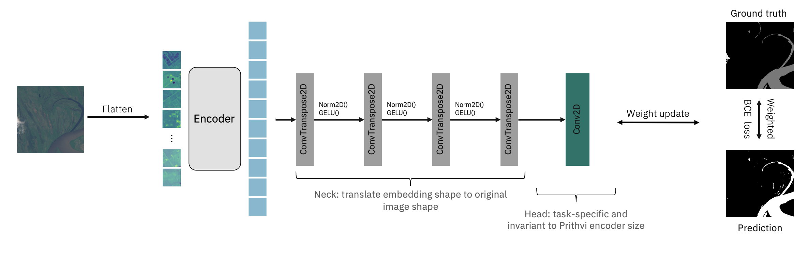

### Model and Inputs
The pretrained [Prithvi-EO-1.0-100m](https://huggingface.co/ibm-nasa-geospatial/Prithvi-100M/blob/main/README.md) model is finetuned to segment the extent of floods on Sentinel-2 images from the [Sen1Floods11 dataset](https://github.com/cloudtostreet/Sen1Floods11).

The dataset consists of 446 labeled 512x512 chips that span all 14 biomes, 357 ecoregions, and 6 continents of the world across 11 flood events. The benchmark associated to Sen1Floods11 provides results for fully convolutional neural networks trained in various input/labeled data setups, considering Sentinel-1 and Sentinel-2 imagery.

We extract the following bands for flood mapping:

1. Blue
2. Green
3. Red
4. Narrow NIR
5. SWIR 1
6. SWIR 2

Labels represent no water (class 0), water/flood (class 1), and no data/clouds (class -1).

The Prithvi-100m model was initially pretrained using a sequence length of 3 timesteps. Based on the characteristics of this benchmark dataset, we focus on single-timestamp segmentation. This demonstrates that our model can be utilized with an arbitrary number of timestamps during finetuning.



### Code

The code for this finetuning is available through [github](https://github.com/NASA-IMPACT/hls-foundation-os/).

The configuration used for finetuning is available through this [config](https://github.com/NASA-IMPACT/hls-foundation-os/blob/main/fine-tuning-examples/configs/sen1floods11.py).

### Results

Finetuning the geospatial foundation model for 100 epochs leads to the following performance on the test dataset:

|     **Classes**    | **IoU**| **Acc**|
|:------------------:|:------:|:------:|
|      No water      | 96.90% | 98.11% |
|     Water/Flood    | 80.46% | 90.54% |

|     **aAcc**       |**mIoU**|**mAcc**|
|:------------------:|:------:|:------:|
|       97.25%       | 88.68% | 94.37% |


The performance of the model has been further validated on an unseen, holdout flood event in Bolivia. The results are consistent with the performance on the test set:


|     **Classes**    | **IoU**| **Acc**|
|:------------------:|:------:|:------:|
|      No water      | 95.37% | 97.39% |
|     Water/Flood    | 77.95% | 88.74% |

|     **aAcc**       |**mIoU**|**mAcc**|
|:------------------:|:------:|:------:|
|       96.02%       | 86.66% | 93.07% |

Finetuning took ~1 hour on an NVIDIA V100.


### Inference
The github repo includes an inference script that allows running the flood mapping model for inference on Sentinel-2 images. These inputs have to be geotiff format, including 6 bands for a single time-step described above (Blue, Green, Red, Narrow NIR, SWIR, SWIR 2) in order. There is also a **demo** that leverages the same code **[here](https://huggingface.co/spaces/ibm-nasa-geospatial/Prithvi-100M-sen1floods11-demo)**.

### Feedback

Your feedback is invaluable to us. If you have any feedback about the model, please feel free to share it with us. You can do this by submitting issues on our open-source repository, [hls-foundation-os](https://github.com/NASA-IMPACT/hls-foundation-os/issues), on GitHub.

### Citation

If this model helped your research, please cite our model in your publications. Here is an example BibTeX entry:

```
@misc{Prithvi-100M-flood-mapping,
    author          = {Jakubik, Johannes and Fraccaro, Paolo and Oliveira Borges, Dario and Muszynski, Michal and Weldemariam, Kommy and Zadrozny, Bianca and Ganti, Raghu and Mukkavilli, Karthik},
    month           = aug,
    doi             = { 10.57967/hf/0973 },
    title           = {{Prithvi 100M flood mapping}},
    repository-code = {https://huggingface.co/ibm-nasa-geospatial/Prithvi-100M-sen1floods11},
    year            = {2023}
}
```
## OneScience Functional Validation

This directory contains code only. The official checkpoint is stored in the SDU-Test shared directory.

Checkpoint paths:

- Notebook: `/root/group_data/SDU-Test/Prithvi-EO-1.0-100M-sen1floods11/sen1floods11_Prithvi_100M.pth`
- SCNet: `/public/share/sugonhpcapp01/SDU-Test/Prithvi-EO-1.0-100M-sen1floods11/sen1floods11_Prithvi_100M.pth`

Run the functional validation in the Notebook container:

```bash
python train.py --device cuda --weights /root/group_data/SDU-Test/Prithvi-EO-1.0-100M-sen1floods11/sen1floods11_Prithvi_100M.pth
```

When no paired local dataset is available, the script generates synthetic Sentinel-2-like input. This validates checkpoint loading and inference functionality only; it does not establish scientific accuracy.

### Download the checkpoint

The checkpoint is not stored in Git. OneScience users can use the shared checkpoint path documented above.

For environments without access to the shared directory, download and verify the official Hugging Face checkpoint with:

```bash
bash download_weights.sh
```

An alternative output path can be supplied as the first argument:

```bash
bash download_weights.sh /path/to/sen1floods11_Prithvi_100M.pth
```
