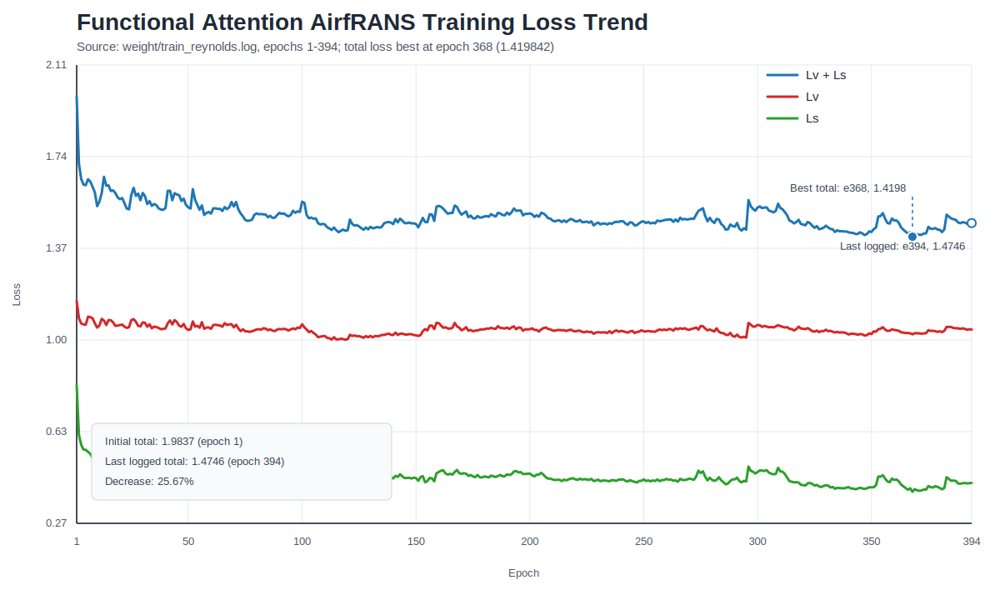

# Functional Attention AirfRANS 训练收敛与复现实验报告

生成时间：2026-07-17  
工程目录：`/public/home/liuyushuang/code/onecode_new_model/Functional_Attention`  
论文：*Functional Attention: From Pairwise Affinities to Functional Correspondences*，arXiv:2605.31559  
实验目标：AirfRANS OOD Reynolds，`reynolds_train -> reynolds_test`

## 1. 结论摘要

当前整理包中的 checkpoint 已确认保存到 `epoch=400`，checkpoint 内记录的最终训练总损失为 `1.4688377541`。可审计的逐 epoch 日志 `weight/train_reynolds.log` 记录到 `epoch=394`，因此本报告中的分项收敛曲线统计基于 `1-394` 轮日志，最终总损失使用 checkpoint 元信息补充。

训练曲线整体是下降后平台震荡：`Lv + Ls` 从第 1 轮的 `1.983721` 降到第 394 轮的 `1.474557`，下降约 `25.67%`；checkpoint 第 400 轮总损失为 `1.468838`，相对第 1 轮下降约 `25.96%`。日志内最优总损失出现在第 368 轮，为 `1.419842`，第 400 轮 checkpoint 总损失比该日志最优值高约 `3.45%`。

当前测试集结果显著低于论文 Table 3 报告值：当前 pressure-only lift relative error 为 `446.14%`，Spearman lift 为 `-0.0658`；论文 AirfRANS OOD Reynolds 报告 `CL` relative error 为 `23.4%`，`rho_L` 为 `0.994`。这不是严格同口径对比，因为当前实现的力系数是 pressure-only 近似，缺少论文 Eq.57 所需的 wall shear stress、官方表面积分权重和完整气动力归一化。

当前不能仅凭训练曲线判断“经典过拟合”，因为训练过程中没有同步记录验证集 loss；但从测试集力系数指标看，当前实现存在明显的实验协议/评估口径偏差和泛化不足，需要优先补齐官方气动力指标与数据预处理细节。

## 2. 数据集与当前实验设置

### 2.1 数据集

当前复现使用 AirfRANS 原始 `Dataset.zip` 风格数据。整理后的 `Functional_Attention` 包不内置原始数据，`model/funcattn_airfrans/data/raw/` 和 `model/funcattn_airfrans/data/cache/` 仅保留 `.gitkeep`。复跑时需要将数据解压到：

```text
model/funcattn_airfrans/data/raw/Dataset
```

原始下载链接：

```text
https://data.isir.upmc.fr/extrality/NeurIPS_2022/Dataset.zip
```

本地已核对的 manifest split 数量如下：

| Split | 样本数 | 用途 |
| --- | ---: | --- |
| `full_train` | 800 | AirfRANS full train |
| `scarce_train` | 200 | 小样本训练 split |
| `reynolds_train` | 504 | 当前训练 split |
| `aoa_train` | 804 | OOD AoA 训练 split |
| `full_test` | 200 | AirfRANS full test |
| `reynolds_test` | 496 | 当前测试 split |
| `aoa_test` | 196 | OOD AoA 测试 split |

### 2.2 输入输出协议

当前工程读取每个 case 的 `*_internal.vtu` 和 `*_aerofoil.vtp`，构造非结构点云上的体场监督。

| 项目 | 当前设置 |
| --- | --- |
| 输入特征 | `[x, y, u_inf_x, u_inf_y, sdf, normal_x, normal_y]` |
| 输入维度 | `7` |
| 输出变量 | `[u, v, p, nut]` |
| 输出维度 | `4` |
| 表面识别 | 通过近壁/速度条件构造 `surf` mask |
| 表面法向 | 将 aerofoil 表面法向通过最近邻对齐到 internal 表面点 |
| 采样策略 | 每个 case 最多 `32000` 个点，确定性下采样 |
| 归一化 | 使用 `stats_reynolds_train.npz` 对输入和输出做 mean/std 标准化 |

### 2.3 模型与训练配置

配置来源：`config/config.yaml`

| 类别 | 参数 | 当前值 |
| --- | --- | ---: |
| 模型 | hidden channels | `256` |
| 模型 | layers | `8` |
| 模型 | heads | `8` |
| 模型 | bases/modes | `32` |
| 模型 | FFN ratio | `4` |
| 模型 | dropout | `0.0` |
| 模型 | ridge lambda | `1e-3` |
| 训练 | epochs | `400` |
| 训练 | batch size | `4` |
| 训练 | optimizer | `Adam` |
| 训练 | learning rate | `1e-3` |
| 训练 | loss | `Lv + Ls` |
| 训练 | surface loss weight | `1.0` |
| 训练 | seed | `42` |
| 评估 | split | `reynolds_test` |
| 权重 | checkpoint | `weight/funcattn_reynolds.pt` |
| 结果 | output | `weight/result_reynolds.json` |

与论文 Table 10 相同的部分包括：`400` epochs、Adam、`1e-3` 学习率、`8` 层、`8` heads、`256` channels、`32` bases、`Lv + Ls` 损失形式。主要差异是当前为了加速将 batch size 设为 `4`，论文表格中 AirfRANS batch size 为 `1`。

## 3. 训练收敛趋势

### 3.1 Loss 趋势图



图中曲线来自 `weight/train_reynolds.log` 的逐 epoch 记录，覆盖 `epoch=1-394`。其中 `Lv + Ls` 为训练总损失，`Lv` 为体场损失，`Ls` 为表面损失；对应的原始曲线数据已导出到 `reports/figures/training_loss_trend.csv`，便于后续复查或重新绘图。

需要注意的是，当前 checkpoint 记录已到 `epoch=400`，但日志中可用于绘图的逐轮分项 loss 只到 `epoch=394`，因此图中不强行插入缺少 `Lv/Ls` 分项的最后 6 轮。

### 3.2 关键节点

| Epoch | `Lv + Ls` | `Lv` | `Ls` | 说明 |
| ---: | ---: | ---: | ---: | --- |
| 1 | 1.983721 | 1.160951 | 0.822770 | 初始阶段 |
| 10 | 1.542715 | 1.053872 | 0.488844 | 前 10 轮快速下降 |
| 20 | 1.570600 | 1.064181 | 0.506418 | 早期开始震荡 |
| 50 | 1.538049 | 1.044579 | 0.493470 | 进入缓慢下降区间 |
| 100 | 1.560537 | 1.067175 | 0.493363 | 仍有明显波动 |
| 150 | 1.471008 | 1.022839 | 0.448168 | 平台期附近 |
| 200 | 1.513532 | 1.047315 | 0.466216 | 震荡回升 |
| 250 | 1.481356 | 1.038673 | 0.442683 | 缓慢改善 |
| 300 | 1.537172 | 1.064624 | 0.472548 | 阶段性回升 |
| 350 | 1.438980 | 1.027776 | 0.411204 | 后期较优区间 |
| 368 | 1.419842 | 1.026767 | 0.393075 | 日志内最优总损失 |
| 394 | 1.474557 | 1.046060 | 0.428497 | 最后一条完整日志 |
| 400 | 1.468838 | 暂无分项日志 | 暂无分项日志 | checkpoint 记录的最终总损失 |

### 3.3 分阶段统计

| Epoch 区间 | 平均 `Lv + Ls` | 平均 `Lv` | 平均 `Ls` | 观察 |
| --- | ---: | ---: | ---: | --- |
| 1-20 | 1.634119 | 1.079575 | 0.554544 | 下降最快，主要来自表面损失快速降低 |
| 21-100 | 1.537883 | 1.056537 | 0.481346 | 下降放缓，训练进入震荡 |
| 101-200 | 1.489719 | 1.035893 | 0.453826 | 总损失继续下降，但幅度有限 |
| 201-300 | 1.485141 | 1.040982 | 0.444159 | 基本平台化 |
| 301-394 | 1.468767 | 1.042204 | 0.426563 | 后期小幅改善，仍存在波动 |

### 3.4 收敛判断

从训练日志看，模型确实学到了有效信号，但收敛不充分：

- 总损失从第 1 轮到第 394 轮下降 `25.67%`，到 checkpoint 第 400 轮下降 `25.96%`。
- `Ls` 从第 1 轮到第 394 轮下降 `47.92%`，表面区域拟合改善较明显。
- `Lv` 从第 1 轮到第 394 轮仅下降 `9.90%`，体场部分是主要瓶颈。
- 第 368 轮达到日志内最优 `Lv + Ls=1.419842`，后续有回升；最终 checkpoint 总损失比日志最优高约 `3.45%`。
- 没有验证集曲线，无法严格判断是否过拟合；但测试集力系数排名为负相关，说明当前训练目标、数据处理或评估口径与论文目标仍不一致。

## 4. 当前评估结果

评估文件：`weight/result_reynolds.json`

| 指标 | 当前结果 | 说明 |
| --- | ---: | --- |
| `relative_l2_mean` | 1.171189 | 全场 masked relative L2，越低越好 |
| `volume_relative_l2_mean` | 1.172989 | 非表面点 relative L2 |
| `surface_relative_l2_mean` | 0.968944 | 表面点 relative L2 |
| `pressure_only_lift_relative_error` | 4.461440 | pressure-only 近似升力相对误差，约 `446.14%` |
| `spearman_lift` | -0.065784 | pressure-only 升力排序相关，约 `-6.58%` |

这些结果说明：当前 checkpoint 在 relative L2 和升力相关指标上都未达到论文主实验水平。尤其是 Spearman lift 为负，表示当前 pressure-only 升力估计无法正确排序 `reynolds_test` 中不同 case 的升力。

## 5. 与原论文结果对比

论文 Table 3 报告 Functional Attention 在 AirfRANS OOD Reynolds 上的指标如下：

| 指标 | 当前工程 | 原论文 OOD Reynolds | 差异 |
| --- | ---: | ---: | ---: |
| `CL` relative error | `446.14%` | `23.4%` | 当前约为论文的 `19.07x` |
| `rho_L` / Spearman lift | `-0.0658` | `0.994` | 当前低 `1.0598` |

需要强调：上表只能作为“效果差距提示”，不能作为严格复现结论。原因如下：

1. 当前 `CL` 指标是 pressure-only 近似，只用压力和法向估计升力，没有加入 wall shear stress。
2. 当前实现没有官方表面单元长度/面积权重，默认近似为均匀权重。
3. 当前 lift 方向没有完整复现论文 Eq.57 的气动力系数归一化流程。
4. 当前训练输出为完整 `[u, v, p, nut]` 场，论文 AirfRANS 主指标更聚焦 surface pressure 到 lift coefficient 的效果。
5. 当前 batch size 为 `4`，论文 Table 10 为 `1`；这会改变优化动态，尤其在非结构点云和小 batch Adam 下可能影响最终泛化。
6. 论文没有完全公开 AirfRANS 预处理、wall shear stress 字段、归一化统计、scheduler、初始化和 seed 等细节；当前工程是独立重写实现。

## 6. 风险与问题定位

### 6.1 可追溯性风险

`weight/funcattn_reynolds.pt` 内部记录 `epoch=400`，`last_loss=1.4688377541`，但 `weight/train_reynolds.log` 的最后一条逐 epoch 记录是 `epoch=394`。这说明末段 395-400 的 checkpoint 已保存，但逐轮分项 loss 没有完整写入当前归档日志。后续应将 checkpoint 元信息、训练日志和评估结果统一写入同一个 run 目录。

### 6.2 训练目标风险

当前训练目标是全场 `[u, v, p, nut]` 的 `Lv + Ls`。如果论文 AirfRANS 主实验实际更强调 surface pressure 和 lift ranking，那么全场多变量训练可能稀释 pressure/surface 的优化权重。当前 `Lv` 降幅很小，也说明体场目标占据了较大训练难度。

### 6.3 指标口径风险

当前 `pressure_only_lift_relative_error` 只是近似工程指标。论文 Eq.57 的气动力指标需要更完整的表面积分、切向剪切项和归一化；如果这部分缺失，Spearman 和相对误差会严重失真。

### 6.4 数据预处理风险

当前实现包含 SDF、freestream、surface normal 和 mean/std 标准化，但仍可能与论文或官方 AirfRANS pipeline 存在差异，包括：

- SDF 符号方向；
- 表面点识别方式；
- 法向方向；
- pressure/velocity/nut 的归一化尺度；
- surface quadrature 权重；
- train/test split 与缓存采样细节。

## 7. 后续改进方案

### P0：先补齐论文同口径评估

1. 实现严格的 AirfRANS force metric：检查数据中是否包含 wall shear stress 或可计算剪切应力的字段，补齐压力项、剪切项、AoA 方向、参考速度和参考长度/面积归一化。
2. 为 aerofoil surface 构造真实线段长度权重，而不是均匀权重；二维翼型至少应按相邻表面点弧长做积分近似。
3. 在 `result.py` 中同时输出 pressure-only 和 paper-aligned 两套指标，避免近似指标被误认为论文指标。
4. 增加 `result_reynolds_paper_aligned.json`，记录 `CL relative error`、`rho_L`、样本数、是否包含 wall shear stress、权重构造方式。

### P1：对齐训练协议

1. 按论文设置复跑 batch size `1`，同时保留 batch size `4` 作为加速 ablation；如果显存允许，使用梯度累积模拟不同 batch。
2. 增加验证集日志和 best checkpoint 保存逻辑，不只保存最后一轮。
3. 每个 epoch 写入 JSONL 日志，包含 `epoch`、`Lv`、`Ls`、`total`、learning rate、checkpoint path 和耗时。
4. 固定随机种子并记录环境：Python、PyTorch、设备、CUDA/DCU 版本、hostname、启动命令。

### P2：强化 pressure/surface 优化

1. 增加 pressure-only head 或 pressure auxiliary loss，避免 `[u, v, p, nut]` 多目标训练稀释 surface pressure。
2. 对 `Ls` 或 pressure surface loss 做权重扫描，例如 `1.0 / 2.0 / 5.0 / 10.0`。
3. 比较三种任务形式：全场四变量、pressure-only surface、全场四变量加 pressure/surface 辅助项。
4. 对 `bases=32/64`、`channels=256`、`layers=8` 做小规模 ablation，先看 `rho_L` 是否恢复正相关。

### P3：数据与预处理核验

1. 编写 `scripts/inspect_case.py`，输出每个 case 的字段列表、点数、surface 点数、normal 范围、pressure 范围和 SDF 范围。
2. 抽查法向方向：确认 pressure force 的方向与论文坐标系一致。
3. 复核 `surf` mask：当前表面识别依赖速度近零条件，建议与 aerofoil 点集距离阈值交叉验证。
4. 复核归一化：比较 per-field mean/std、freestream scaling、pressure coefficient scaling 三种方式。

### P4：报告与归档自动化

1. 新增 `scripts/report.py` 或 `scripts/analyze_training.py`，自动解析训练日志、checkpoint 和 result JSON。
2. 每次训练生成独立 run 目录，例如 `runs/reynolds_bs4_400ep_seed42/`。
3. 保存收敛曲线 CSV/PNG、最终指标 JSON、配置快照和 README 摘要。
4. 在 ModelScope 包中保留轻量 smoke test，不内置原始数据；完整数据和长训练结果通过说明文档引用。

## 8. 建议的下一轮复现实验矩阵

| 实验编号 | 目的 | 关键设置 | 预期判断 |
| --- | --- | --- | --- |
| E1 | 同口径 baseline | batch size `1`，400 epoch，当前全场 loss | 确认 batch size 差异影响 |
| E2 | pressure-focused | surface pressure-only target | 检查 `CL` 和 `rho_L` 是否显著改善 |
| E3 | loss reweight | `Ls`/pressure 权重扫描 | 找到 surface 指标更优的训练目标 |
| E4 | metric aligned | paper-aligned force metric | 判断当前差距有多少来自评估口径 |
| E5 | data audit | 法向、SDF、surface mask、归一化核验 | 排除数据处理方向性错误 |

## 9. 最终判断

当前工程已经完成 Functional Attention 在 AirfRANS OOD Reynolds 上的可运行训练、checkpoint 保存和测试评估流程；训练损失具备下降趋势，说明模型和数据管线基本连通。但当前结果距离论文主实验仍有明显差距，主要原因不是单纯训练轮数不足，而是评估口径、AirfRANS 力系数计算、surface pressure 目标对齐和数据预处理细节尚未完全复现。

下一步最值得优先投入的是“同口径评估”和“pressure/surface 目标对齐”。只有先把 `CL` 与 `rho_L` 的计算方式补齐到论文 Eq.57 附近，后续的训练改进才有可靠的判断标准。
