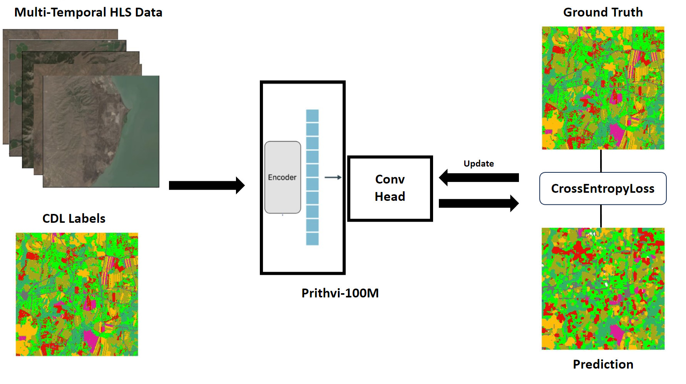

# Prithvi Multi-Temporal Crop Classification

This model applies the Prithvi-EO 100M foundation-model backbone to
multi-temporal crop and land-cover segmentation.

- Official model:
  https://huggingface.co/ibm-nasa-geospatial/Prithvi-EO-1.0-100M-multi-temporal-crop-classification
- Task: multi-temporal crop classification
- Input: 18-band HLS GeoTIFF, organized as six bands over three time steps
- Output: 13 per-pixel crop or land-cover classes
- Spatial size used by the functional test: 224 x 224



## Files

- `train.py`: self-contained checkpoint validation and inference script.
- `multi_temporal_crop_classification_Prithvi_100M.py`: official model
  configuration code.
- `download_weights.sh`: downloads and verifies the official checkpoint.
- `requirements.txt`: non-framework Python dependencies.

Model weights, generated arrays, validation results, and test reports are not
stored in Git.

## Shared checkpoint

OneScience Notebook:

```text
/root/group_data/SDU-Test/Prithvi-EO-1.0-100M-multi-temporal-crop-classification/multi_temporal_crop_classification_Prithvi_100M.pth
```

SCNet:

```text
/public/share/sugonhpcapp01/SDU-Test/Prithvi-EO-1.0-100M-multi-temporal-crop-classification/multi_temporal_crop_classification_Prithvi_100M.pth
```

## Download the checkpoint

For environments without access to the shared directory:

```bash
bash download_weights.sh
```

An alternative output path can be supplied as the first argument:

```bash
bash download_weights.sh /path/to/multi_temporal_crop_classification_Prithvi_100M.pth
```

The script verifies the checkpoint using its expected SHA256 hash.

## Functional validation

Run in the OneScience Notebook container:

```bash
python train.py --device cuda \
  --weights /root/group_data/SDU-Test/Prithvi-EO-1.0-100M-multi-temporal-crop-classification/multi_temporal_crop_classification_Prithvi_100M.pth \
  --input none
```

The completed public-path validation produced:

- Status: `PASS`
- Validation level: `functional_only`
- Strict checkpoint load: `True`
- Parameters: `140,330,266`
- Input shape: `(18, 224, 224)`
- Model input shape: `(1, 6, 3, 224, 224)`
- Output shape: `(13, 224, 224)`
- Finite-output ratio: `1.000000`
- Median latency: `106.280 ms`
- Peak GPU memory: `1573.53 MB`
- Synthetic mIoU: `0.102390`
- Synthetic accuracy: `0.196500`

The test uses deterministic synthetic multi-temporal HLS-like input and
pseudo-labels. It establishes checkpoint compatibility and functional
inference only; it does not establish scientific accuracy.
