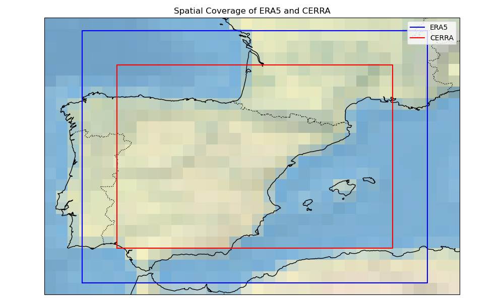
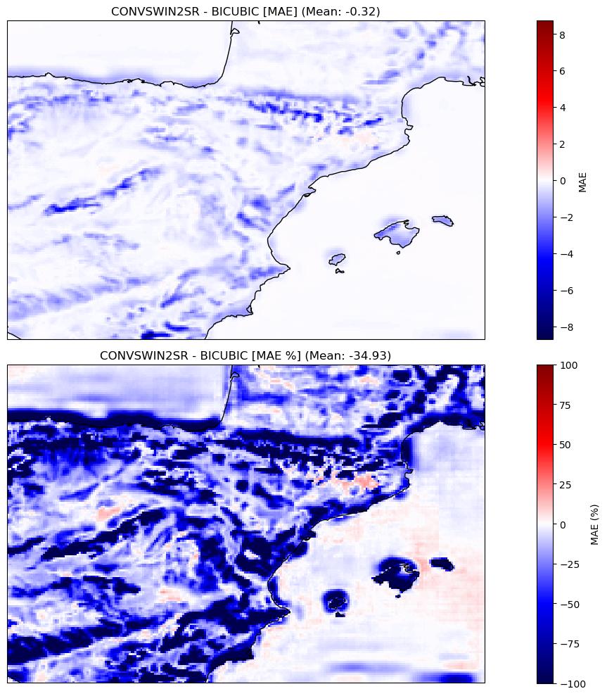
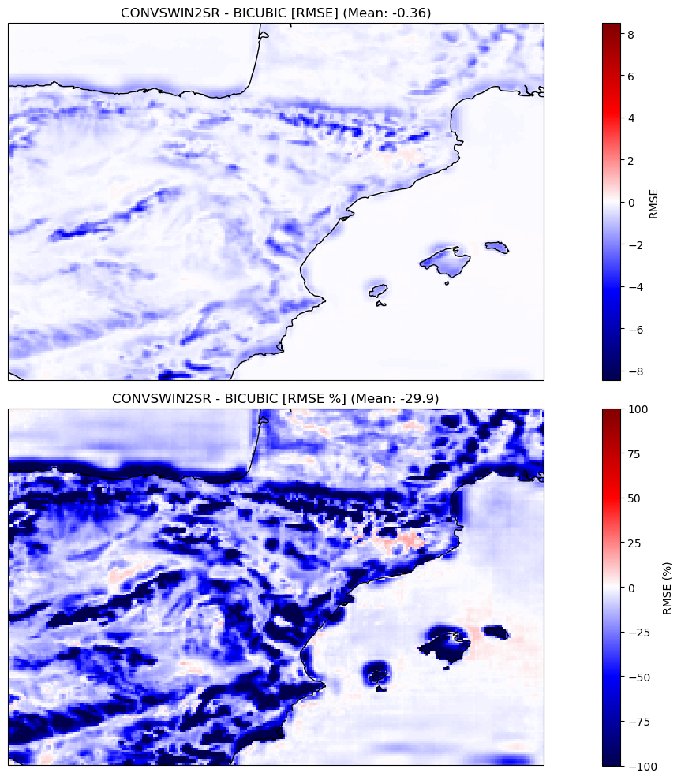
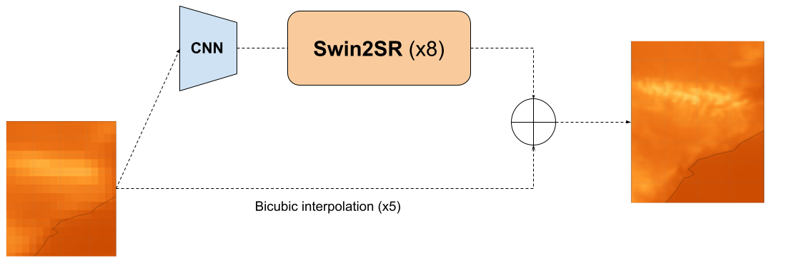

# Europe Reanalysis Super Resolution

The aim of the project is to create a Machine learning (ML) model that can generate high-resolution regional reanalysis data (similar to the one produced by CERRA) by 
downscaling global reanalysis data from ERA5. 

This will be accomplished by using state-of-the-art Deep Learning (DL) techniques like U-Net, conditional GAN, and diffusion models (among others). Additionally, 
an ingestion module will be implemented to assess the possible benefit of using CERRA pseudo-observations as extra predictors. Once the model is designed and trained, 
a detailed validation framework takes the place. 

It combines classical deterministic error metrics with in-depth validations, including time series, maps, spatio-temporal correlations, and computer vision metrics, 
disaggregated by months, seasons, and geographical regions, to evaluate the effectiveness of the model in reducing errors and representing physical processes. 
This level of granularity allows for a more comprehensive and accurate assessment, which is critical for ensuring that the model is effective in practice. 

Moreover, tools for interpretability of DL models can be used to understand the inner workings and decision-making processes of these complex structures by analyzing 
the activations of different neurons and the importance of different features in the input data.

This work is funded by [Code for Earth 2023](https://codeforearth.ecmwf.int/) initiative. The model **ConvSwin2SR** is released in Apache 2.0, making it usable without 
restrictions anywhere.

# Table of Contents

- [Model Card for Europe Reanalysis Super Resolution](#model-card-for--model_id-)
- [Table of Contents](#table-of-contents)
- [Model Details](#model-details)
  - [Model Description](#model-description)
- [Uses](#uses)
  - [Direct Use](#direct-use)
  - [Out-of-Scope Use](#out-of-scope-use)
- [Bias, Risks, and Limitations](#bias-risks-and-limitations)
- [Training Details](#training-details)
  - [Training Data](#training-data)
  - [Training Procedure](#training-procedure)
    - [Preprocessing](#preprocessing)
    - [Speeds, Sizes, Times](#speeds-sizes-times)
- [Evaluation](#evaluation)
  - [Testing Data, Factors & Metrics](#testing-data-factors--metrics)
    - [Testing Data](#testing-data)
    - [Factors](#factors)
    - [Metrics](#metrics)
  - [Results](#results)
- [Technical Specifications](#technical-specifications-optional)
  - [Model Architecture](#model-architecture)
    - [Components](#components)
    - [Configuration details](#configuration-details)
    - [Loss function](#loss-function)
  - [Computing Infrastructure](#computing-infrastructure)
    - [Hardware](#hardware)
    - [Software](#software)
- [Authors](#authors)

# Model Details

## Model Description

<!-- Provide a longer summary of what this model is/does. -->
We present the ConvSwin2SR tranformer, a vision model for down-scaling (from 0.25º to 0.05º) regional reanalysis grids in the mediterranean area.

- **Developed by:** A team of Predictia Intelligent Data Solutions S.L. & Instituto de Fisica de Cantabria (IFCA)
- **Model type:** Vision model
- **Language(s) (NLP):** en, es
- **License:** Apache-2.0
- **Resources for more information:** More information needed
    - [GitHub Repo](https://github.com/ECMWFCode4Earth/DeepR)

# Uses

## Direct Use

The primary use of the ConvSwin2SR transformer is to enhance the spatial resolution in the Mediterranean area of global reanalysis grids using a regional reanalysis grid 
as groundtruth. This enhancement is crucial for more precise climate studies, which can aid in better decision-making for various stakeholders including policymakers, 
researchers, and weather-dependent industries like agriculture, energy, and transportation.

## Out-of-Scope Use

The model is specifically designed for downscaling ERA5 reanalysis grids to the CERRA regional reanalysis grid and may not perform well or provide accurate results 
for other types of geospatial data or geographical regions. 

# Bias, Risks, and Limitations

Significant research has explored bias and fairness issues with language models (see, e.g., [Sheng et al. (2021)](https://aclanthology.org/2021.acl-long.330.pdf) 
and [Bender et al. (2021)](https://dl.acm.org/doi/pdf/10.1145/3442188.3445922)). Predictions generated by the model may include disturbing and harmful stereotypes 
across protected classes; identity characteristics; and sensitive, social, and occupational groups.

# Training Details

## Training Data

The datasets that are mainly used in the project can be found in the following Copernicus Climate Data Store catalogue entries:

- [ERA5 hourly data on single levels from 1940 to present](https://cds.climate.copernicus.eu/cdsapp#!/dataset/reanalysis-era5-single-levels?tab=overview)
  
- [CERRA sub-daily regional reanalysis data for Europe on single levels from 1984 to present](https://cds.climate.copernicus.eu/cdsapp#!/dataset/reanalysis-cerra-single-levels?tab=overview)

1. Input low-resolution grids (ERA5):

  The input grids are structured as a 3D array with dimensions of (time, 60, 44), where 60 and 44 are the number of grid points along the longitude and latitude axes, 
  respectively. Geographically, these grids cover a longitude range from -8.35 to 6.6 and a latitude range from 46.45 to 35.50. 
  This implies that the data covers a region extending from a westernmost point at longitude -8.35 to an easternmost point at longitude 6.6, and from a 
  northernmost point at latitude 46.45 to a southernmost point at latitude 35.50.

2. Target high-resolution grids (CERRA):

  They are represented as a 3D array with larger dimensions of (time, 240, 160), indicating a finer grid resolution compared to the input grids. Here, 240 and 160 are 
  the number of grid points along the longitude and latitude axes, respectively. The geographical coverage for these high-resolution grids is defined by a longitude 
  range from -6.85 to 5.1 and a latitude range from 44.95 to 37. This region extends from a westernmost point at longitude -6.85 to an easternmost point at longitude 5.1,
  and from a northernmost point at latitude 44.95 to a southernmost point at latitude 37.

The dataset's temporal division is structured to optimize model training and subsequent per-epoch validation. 
The training duration spans 29 years, commencing in January 1985 and culminating in December 2013. 
Sequentially, the validation phase begins, covering the period from January 2014 to December 2017. This 4-year interval is solely dedicated to evaluating the model's 
aptitude on data it hasn't been exposed to during training. This separation ensures the model's robustness and its capability to make dependable predictions for the 
validation period.

## Training Procedure

### Preprocessing

The preprocessing of climate datasets ERA5 and CERRA, extracted from the Climate Data Store (CDS), is a critical step before their utilization in training models. 
This section defines the preprocessing steps undertaken to homogenize these datasets into a common format. The steps include unit standardization, coordinate system 
rectification, and grid interpolation. The methodology employed in each step is discussed comprehensively in the following paragraphs:

- Unit Standardization: A preliminary step in the preprocessing pipeline involved the standardization of units across both datasets.
  This was imperative to ensure a uniform unit system, facilitating a seamless integration of the datasets in later stages. 

- Coordinate System Rectification: The coordinate system of the datasets was rectified to ensure a coherent representation of geographical information.
  Specifically, the coordinates and dimensions were renamed to a standardized format with longitude (lon) and latitude (lat) as designated names.
  The longitude values were adjusted to range from -180 to 180 instead of the initial 0 to 360 range, while latitude values were ordered in ascending order,
  thereby aligning with conventional geographical coordinate systems.

- Grid Interpolation: The ERA5 dataset is structured on a regular grid with a spatial resolution of 0.25º, whereas the CERRA dataset inhabits a curvilinear grid with
  a Lambert Conformal projection of higher spatial resolution (0.05º). To overcome this disparity in the grid system, a grid interpolation procedure is performed.
  This step is crucial to align the datasets onto a common format, a regular grid (with different spatial resolutions), thereby ensuring consistency in spatial
  representation. The interpolation transformed the CERRA dataset to match the regular grid structure of the ERA5 dataset, keeping its initial spatial resolution
  of 0.05º (5.5 km).

### Speeds, Sizes, Times

- Training time: The training duration for the ConvSwin2SR model is notably extensive, clocking in at 3,648 days to complete a total of 100 epochs with
  a batch size of 2 for a total number of batches equal to ~43000.

- Model size: The ConvSwin2SR model is a robust machine learning model boasting a total of 12,383,377 parameters.
  This size reflects a substantial capacity for learning and generalizing complex relationships within the data, enabling the model to
  effectively upscale lower-resolution reanalysis grids to higher-resolution versions.

- Inference speed: The ConvSwin2SR model demonstrates a commendable inference speed, particularly when handling a substantial batch of samples.
  Specifically, when tasked with downscaling 248 samples, which is synonymous with processing data for an entire month at 3-hour intervals,
  the model completes the operation in a mere 21 seconds. This level of efficiency is observed in a local computing environment outfitted with 16GB of
  RAM and 4GB of GPU memory. 
 
# Evaluation

<!-- This section describes the evaluation protocols and provides the results. -->

## Testing Data, Factors & Metrics

### Testing Data

In terms of spatial dimensions, both the input grids from ERA5 and the target high-resolution grids from CERRA remain consistent throughout the training and testing phases.
This spatial consistency ensures that the model is evaluated under the same geographic conditions as it was trained, allowing for a direct comparison of its performance 
across different temporal segments.

The testing data samples correspond to the three-year period from 2018 to 2020, inclusive. This segment is crucial for assessing the model's real-world applicability and 
its performance on the most recent data points, ensuring its relevance and reliability in current and future scenarios.

## Results 

In our evaluation, the proposed model displayed a significant enhancement over the established baseline, which employs bicubic interpolation for the same task. 
Specifically, our model achieved a noteworthy 34.93% reduction in Mean Absolute Error (MAE), a metric indicative of the average magnitude of errors between 
predicted and actual values. Furthermore, there was a near 30% improvement in the Root Mean Square Error (RMSE), which measures the square root of the average 
of squared differences between predictions and actual values.

These metrics not only underscore the model's capability to predict with greater precision but also emphasize its reduced propensity for errors. 
In comparison to the bicubic interpolation baseline, our model's superior predictive accuracy is evident, positioning it as a more reliable tool for this task.

- Mean absolute error (MAE):
  
  

- Root mean squared error (RMSE):

  

# Technical Specifications

## Model Architecture

Our model's design is deeply rooted in the Swin2 architecture, specifically tailored for Super Resolution (SR) tasks.
We've harnessed the [transformers library](https://github.com/huggingface/transformers) to streamline and simplify the model's design.

### Components

- **Transformers Component**: Central to our model is the [transformers.Swin2SRModel](https://huggingface.co/docs/transformers/model_doc/swin2sr#transformers.Swin2SRModel). This component amplifies the spatial resolution of its inputs by a factor of 8. Notably, Swin2SR exclusively supports upscaling ratios that are powers of 2. 
- **Convolutional Neural Network (CNN) Component**: Given that our actual upscale ratio is approximately 5 and the designated output shape is (160, 240),
  we've integrated a CNN. This serves as a preprocessing unit, transforming inputs into (20, 30) feature maps suitable for the Swin2SRModel.
  
The underlying objective of this network is to master the residuals stemming from bicubic interpolation.

### Configuration Details

For those inclined towards the intricacies of the model, the specific parameters governing its behavior are meticulously detailed in the 
[config.json](https://huggingface.co/predictia/convswin2sr_mediterranean/blob/main/config.json).

### Loss function

The Swin2 transformer optimizes its parameters using a composite loss function that aggregates multiple L1 loss terms to enhance its predictive 
accuracy across different resolutions and representations:

1. **Primary Predictions Loss**: 
   - This term computes the L1 loss between the primary model predictions and the reference values. It ensures that the transformer's
     outputs closely match the ground truth.

2. **Downsampled Predictions Loss**: 
   - This term calculates the L1 loss between the downsampled versions of the predictions and the reference values. By incorporating this term,
     the model is incentivized to preserve the underlying relations between both spatial resolutions. The references and predictions are upscaled
     by average pooling by a factor of x5 to match the source resolution. Although  this loss term could be (technically) computed with respect
     to the low-resolution sample, the upscaled reference values are considered, due to the fact that the average pooling used for upscaling does
     not represent the true relationship between both datasets considered.

3. **Blurred Predictions Loss**: 
   - To ensure the model's robustness against small perturbations and noise, this term evaluates the L1 loss between blurred versions of the
     predictions and the references. This encourages the model to produce predictions that maintain accuracy even under slight modifications
     in the data representation. On the other hand, it can smooth the prediction field too much, so it is a term whose use should be studied
     before including it in your model. To produce the blurred values, a gaussian kernel of size 5 is applied.

By combining these loss terms, the ConvSwin2SR is trained to produce realistic predictions.

## Computing Infrastructure

Leveraging GPUs in deep learning initiatives greatly amplifies the pace of model training and inference. This computational edge not only diminishes the total 
computational duration but also equips us to proficiently navigate complex tasks and extensive datasets.

Our profound gratitude extends to our collaborative partners, whose invaluable contribution and support have been cornerstones in the fruition of this project. 
Their substantial inputs have immensely propelled our research and developmental strides.

- **AI4EOSC**: Representing "Artificial Intelligence for the European Open Science Cloud," AI4EOSC functions under the aegis of the European Open Science Cloud (EOSC).
  Initiated by the European Union, EOSC endeavors to orchestrate a cohesive platform for research data and services. AI4EOSC, a distinct arm within EOSC, concentrates
  on embedding and leveraging artificial intelligence (AI) techniques within the open science domain.

- **European Weather Cloud**: Serving as a cloud-centric hub, this platform catalyzes collective efforts in meteorological application design and operations
  throughout Europe. Its offerings are manifold, ranging from disseminating weather forecast data to proffering computational prowess, expert counsel, and
  consistent support.

### Hardware Specifications

Our endeavor harnesses the capabilities of two virtual machines (VMs), each embedded with a dedicated GPU. One VM is equipped with a 16GB GPU, while its counterpart 
is equipped with an even potent 20GB GPU. This strategic hardware alignment proficiently caters to diverse computational needs, spanning data orchestration to model 
fine-tuning and evaluation, ensuring the seamless flow and success of our project.

### Software Resources

For enthusiasts and researchers inclined towards a deeper probe, our model's training and evaluation code is transparently accessible. 
Navigate to our GitHub Repository [ECMWFCode4Earth/DeepR](https://github.com/ECMWFCode4Earth/DeepR) under the ECWMF Code 4 Earth consortium.

### Authors

<!-- This section provides another layer of transparency and accountability. Whose views is this model card representing? How many voices were included in its construction? Etc. -->

- Mario Santa Cruz. Predictia Intelligent Data Solutions S.L.

- Antonio Pérez. Predictia Intelligent Data Solutions S.L.

- Javier Díez. Instituto de Física de Cantabria (IFCA)
